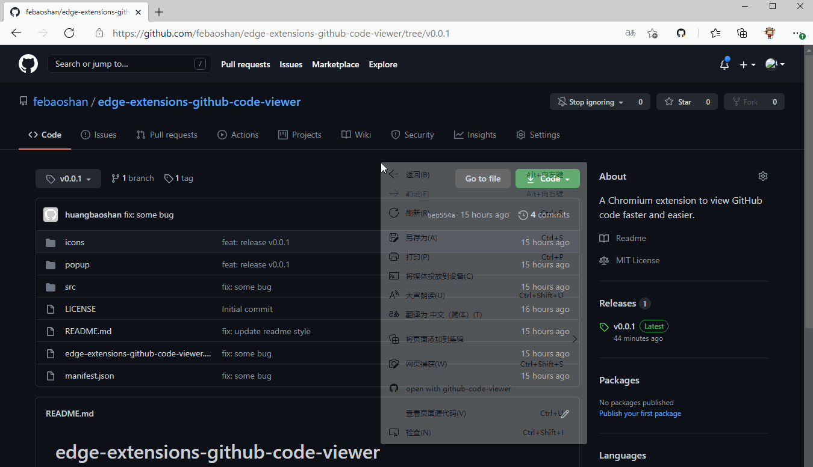

# edge-extensions-github-code-viewer
A Chromium extension to view GitHub code faster and easier.

<html lang="en">
<body>
    

        
         
        Hi there, welcome to use github-code-viewer!
         
        You can enjoy it from the browser context menu(right click) in GitHub.
         
        View this extension on <a target="_blank" href="https://github.com/febaoshan/edge-extensions-github-code-viewer">febaoshan/github-code-viewer</a>
         
        Base on <a target="_blank" href="https://github.com/conwnet/github1s">conwnet/github1s</a>, Thanks <a target="_blank" href="https://github.com/conwnet">conwnet</a>!
    

</body>
</html>

## User Guide

### Install extension locally
1. Donwload edge-extensions-github-code-viewer.zip from this repo;
2. Unzip the edge-extensions-github-code-viewer.zip;
3. Open chrome or edge setting panel, [chrome](chrome://extensions/), [edge](edge://extensions/);
4. Open `developer mode`;
5. Choose `Load decompressed extensions`;
6. Done.

### Install from app store
- Install from [Microsoft-Edge-Extensions-Home](https://microsoftedge.microsoft.com/addons/Microsoft-Edge-Extensions-Home) [githubcodeviewer](https://microsoftedge.microsoft.com/addons/detail/githubcodeviewer/jaaaapanahkknbgdbglnlchbjfhhjlpi).
- Install from [Chrome-webstore](https://chrome.google.com/webstore/detail/github-code-viewer/ecddapgifccgblebfibdgkagfbdagjfn?hl=en&authuser=0)  Thanks to [xcv58](https://github.com/xcv58).

## Enjoy it

